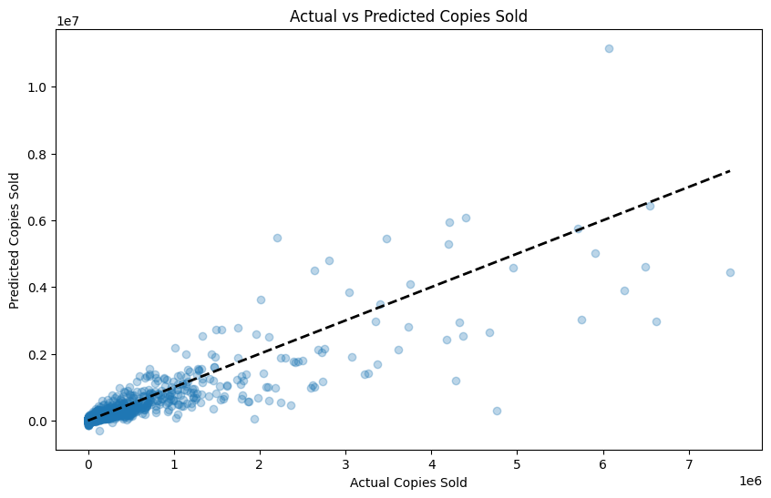
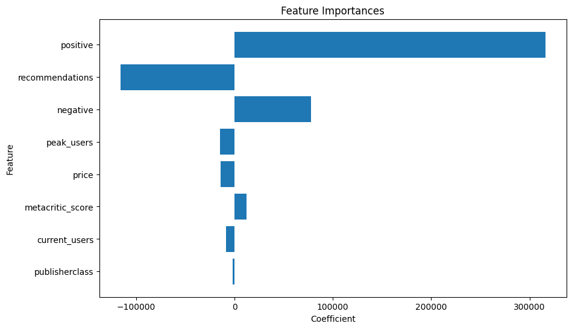

# Steam Demographics Analysis

Welcome to the Steam Demographics Analysis project! This repository contains code and data for analyzing various metrics affecting game sales on the Steam platform.

## Table of Contents
- [Project Overview](#project-overview)
- [Data Collection](#data-collection)
- [Data Preprocessing](#data-preprocessing)
- [Model Building](#model-building)
- [Evaluation](#evaluation)
- [Results](#results)
- [Installation](#installation)

## Project Overview
This project aims to identify the primary factors that influence game sales on Steam. By leveraging multiple data sources and applying advanced data processing techniques, we build a robust multi-linear regression model to predict game sales and understand the key determinants.

## Data Collection
Data is collected from the following sources:
- **Steam API**: Provides game IDs and names.
- **SteamSpy API**: Offers various game metrics such as ratings and reviews.
- **SteamHF Dataset**: Includes additional information like genres, categories, and tags.
- **Gamalytic API**: Supplies publisher class and copies sold data.

## Data Preprocessing
- Missing values are handled using appropriate imputation strategies.
- Numerical features are scaled, and categorical features are encoded.
- Data is split into training and test sets to ensure model robustness.

## Model Building
- A multi-linear regression model is built using Recursive Feature Elimination (RFE) to select the most impactful features.
- The selected features include positive reviews, negative reviews, price, Metacritic score, recommendations, current users, peak users, and publisher class.

## Evaluation
- The model is evaluated using Mean Absolute Error (MAE), Root Mean Squared Error (RMSE), and R-squared (R²) metrics.
- Residuals are analyzed for normality and variance to validate model assumptions.

## Results
- Positive reviews have the largest positive impact on sales.
- Recommendations is also significant predictors.
- Surprisingly, the price does not have a strong influence on sales.



## Installation
To run this project locally, follow these steps:
1. Clone the repository:
   ```bash
   git clone https://github.com/syedramim/Steam-Demographics.git

2. Navigate to the project directory:
   ```bash
   cd Steam-Demographics

3. Install the required packages:
   ```bash
   pip install -r requirements.txt

